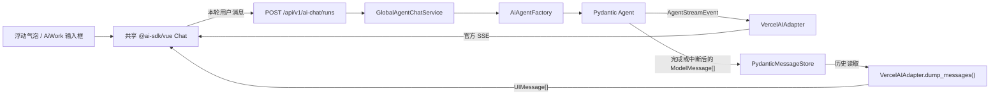

# AiWork 对话气泡与实时消息流实施方案

> 状态：已实施，验收通过（2026-08-16）
>
> 基线：`ee75e09`（Pydantic `ModelMessage` clean-slate 重构完成）
>
> 目标：恢复消息气泡、输入框和实时流；AiWork 页面同时提供正在进行的对话、左侧历史列表及原始消息检查能力，但不恢复旧 AiWork 事件投影或 Global Task 聊天流程。

## 1. 最终架构



必须始终保持三条边界：

- **业务控制链**：业务服务选择 Agent profile、prompt、ToolSet 和权限，`AiAgentFactory` 统一装配 Agent。
- **实时展示链**：`AgentStreamEvent -> VercelAIAdapter -> SSE -> @ai-sdk/vue Chat`，业务服务不转换显示消息。
- **历史展示链**：`PydanticMessageStore -> ModelMessage[] -> VercelAIAdapter.dump_messages() -> UIMessage[]`，前端不解析 Pydantic 消息结构。

## 2. 数据契约与唯一来源

| 数据 | 定位 | 是否持久化 |
| --- | --- | --- |
| Pydantic `ModelMessage[]` | 完整、可信、可继续运行的规范消息历史 | 是，唯一消息事实来源 |
| Vercel `UIMessage[]` | Adapter 生成的前端展示数据 | 否，实时生成或读取时派生 |
| `@ai-sdk/vue Chat` 状态 | 当前浏览器会话中的响应式消息、流状态和错误状态 | 否 |
| `AiChatTurnClaim` | profile 归属、`client_message_id` 幂等领取和终态；不含消息正文 | 是，控制元数据 |

约束：

1. 消息内容继续只保存在 `pydantic_message_histories.messages_json`，并继续用 `ModelMessagesTypeAdapter` 校验和序列化。
2. 不增加第二张 UI 消息表，不保存 `UIMessage`，不把 UI 消息反向当成可信历史。
3. `dump_messages()` 是官方展示转换；Vue 组件只渲染 `UIMessage.parts`，不编写 Pydantic part 到气泡的自定义转换器。
4. Adapter 负责协议转换，不负责 HTML/CSS。气泡、折叠卡片和输入框仍由项目 Vue 组件实现。
5. `ai_chat_turn_claims` 只保存 ID、profile/owner、状态和时间，不得保存 prompt、response、UI part、工具内容或业务任务状态，因此不是第二份消息事实源。

## 3. 产品行为

### 3.1 浮动对话

- 恢复旧版对话区域的视觉资产：空状态、用户/Agent 气泡、滚动容器、输入框、发送中状态和错误提示。
- 浮动区域使用当前标签页的 Pinia `AiChatStore` 和活动 `Chat` 实例。
- 用户发送后立即显示本地用户气泡；Agent 的文字、思考和工具状态由 `Chat` 随 SSE 增量更新。
- 流进行中禁用再次发送，避免向同一个正在运行的 Agent 注入第二条消息。
- 鼠标悬停或键盘聚焦原版气泡图标时自动展示当前活动对话，移出且失焦后收起。
- 点击气泡时用原生 `target="_blank"` 在新标签页打开 `/aiWork?conversation_id=<id>`；悬浮聊天内容中不再显示第二个 AiWork 入口按钮。原标签页继续持有正在消费 SSE 的活动 `Chat`。

### 3.2 AiWork 页面

- 左侧继续使用当前 conversation 列表接口，按 `updated_at` 倒序显示 ID 和时间。
- 右侧默认显示气泡对话；选中的 ID 等于活动 ID 时，直接绑定共享 `Chat.messages`，因此导航不会中断实时流。
- 选择非活动历史时，通过服务端派生的 `UIMessage[]` 显示只读气泡历史。
- 保留当前 Pydantic JSON 树、Raw JSON 和下载能力，但移动到“原始消息”辅助标签，不再作为默认视图。
- 当前会话第一次运行尚未完成时，左侧可显示一个前端临时条目；完成持久化后重新读取列表并以服务端结果替换。
- 不使用轮询刷新消息。当前浏览器发起的运行由 SSE 实时更新；运行完成时只刷新一次历史列表。

### 3.3 本期对话范围

- 新增 `global.chat` 对话 profile，输出为自然语言文本，业务入口为 `GlobalAgentChatService`。
- `GlobalAgentChatService` 只负责选择 prompt、只读 ToolSet、Execution Profile 和权限，然后调用 `AiAgentFactory`。
- 现有 `GlobalAgentService.plan()` 和 `/api/global-task-*` 继续承担独立的全局任务规划/执行职责，但**不接入气泡消息链**。
- `global.chat` 使用独立 ID 前缀 `conversation_global_chat_`，且必须存在服务端 `AiChatTurnClaim` 归属记录。满足两项的已完成历史可以重新激活并继续；类目匹配等其他 Agent 的 conversation 只读展示。
- 写工具、发布确认和 deferred approval 卡片不在本期恢复范围内；以后只能通过 Pydantic 官方 tool approval 与现有服务端权限/状态边界接入。

## 4. 后端设计

### 4.1 `AiAgentFactory` 的流式公共边界

在 `erp_web/services/ai_agent_factory.py` 增加协议无关的异步上下文管理器，例如 `async with open_stream_run(...) as session`。它必须复用 `run_sync()` 的公共装配逻辑，统一完成：

- profile 与 ToolSet 一致性校验；
- 模型绑定、超时、预算、UsageLimits；
- `AiExecutionContext`、`AiToolRuntime`、`AiAgentDependencies`；
- conversation/run/trace ID；
- 唯一 `_build_agent()`；
- instrumentation、错误脱敏和消息捕获；
- 成功、失败、断连后的官方 `ModelMessage[]` 持久化。

流式 session 是 opaque owner，不向协议层暴露 raw `agent`、`deps` 或 limits。它只提供窄的 `events(new_messages)` native event iterator、相关 ID 和完成/关闭语义；真正的 `agent.run_stream_events()` 仍只能在 factory/session 内发生。路由不得调用私有 `_build_agent()`，也不得在其他文件出现第二个 `Agent(...)` 或 Agent run loop。

上下文的生命周期必须覆盖 native event 的完整消费期：

- `__aenter__` 建立消息捕获和 instrumentation span；
- 成功回调保存 `result.all_messages()` 并标记已经持久化；
- native stream 异常先经过 factory 的 `_safe_agent_error()`，再交给官方 Vercel event stream 生成 error chunk，禁止 Provider 原始异常直接进入 SSE；
- `__aexit__` 的 `finally` 关闭 iterator，并在失败、取消或断连时保存已捕获的非空官方消息，且不得重复保存成功结果。

一次用户发送不是“注入正在运行的 Agent”，而是：

1. 按 conversation ID 从 `PydanticMessageStore` 读取服务端可信历史；
2. 用历史加本轮用户输入启动一次新的 Pydantic Agent run；
3. run 完成后用 `result.all_messages()` 原子替换该 conversation 的完整历史。

### 4.2 业务与协议服务

新增两个 focused service：

- `GlobalAgentChatService`：业务入口，固定选择 `global.chat` profile、服务端 instructions 和允许的只读 ToolSet。
- `VercelAiUiService`：唯一 Vercel 协议入口，解析请求、调用业务入口取得 factory session、运行/编码 SSE，并负责历史 `dump_messages()`；不得选择业务工具或改写消息语义。

HTTP route 只调用 facade/service；`ai_work_routes.py` 和 `ai_chat_routes.py` 都不直接导入或装配 `VercelAIAdapter`。

前端不得提交或覆盖以下字段：`use_case_id`、model、system prompt、ToolSet、permissions、tenant、business scope。它只提交 conversation ID 和本轮 UI 用户消息。

### 4.3 客户端历史不可信

Vercel 默认协议会发送完整 `UIMessage[]`，但本项目的连续性必须以服务端 SQLite 历史为准。因此：

- 前端 `DefaultChatTransport.prepareSendMessagesRequest` 只发送最新一条用户 `UIMessage`，同时保留 Adapter 所需的 `id` 和 `trigger`。
- 后端仍再次验证：恰好一条新消息、`role=user`、所有 parts 都是允许的非空 `TextUIPart`、总长度不超限；本期拒绝其他所有客户端 part。
- 后端忽略该 UIMessage 的客户端 metadata，以它的 `id` 作为 `client_message_id`，在运行前原子插入 `AiChatTurnClaim`。
- factory session 只拼接 `PydanticMessageStore` 读取的可信 `message_history` 与 Adapter 官方 `load_messages()` 得到并由服务端重新标记的本轮用户消息。
- Agent instructions 始终由服务端 profile 提供；由于本期入口只允许 text part，客户端 system/file/tool/approval 在转换前即被拒绝，不得进入 session。
- conversation ID 只作为相关性 ID，不是授权凭证；入口仍先执行现有 Host/Origin 请求边界验证。

这样既使用官方 Adapter，又不会把完整客户端历史重复追加到服务端历史，或允许浏览器伪造以前的 Agent/tool 消息。

服务端在领取 conversation 锁后、读取历史后执行两项守卫：

1. 若历史已存在，必须同时满足 Global Chat ID 前缀和服务端 claim 中的 `profile_id=global.chat`、owner/tenant；存在历史但没有归属记录时返回 409。
2. `(conversation_id, client_message_id)` 使用唯一约束。重复领取不得再次运行 Agent；返回 `AI_CHAT_TURN_ALREADY_ACCEPTED`，前端重新读取 `/ui-messages` 收敛状态。

claim 在 Agent 启动前持久化，完成、失败或断连后只更新状态。即使进程在消息保存前退出，同一 ID 也不会重复执行；用户可用新的 UIMessage ID 明确发起新一轮。claim 不参与消息渲染或 Agent history。

当前产品是绑定 `127.0.0.1` 的本机单用户 Demo；claim 中的 local actor/tenant 不是多用户对象授权。若未来允许远程或多租户访问，必须先接入经过认证的 owner/tenant 并在每次读写时授权，不能依靠 conversation ID 或 Origin 代替。

### 4.4 HTTP 接口

保留现有两个接口，并新增一个派生历史接口和一个流接口：

| 方法 | 路径 | 作用 |
| --- | --- | --- |
| GET | `/api/v1/ai-work/conversations` | 历史索引，保持现有契约 |
| GET | `/api/v1/ai-work/conversations/{id}` | 规范 Pydantic JSON，保持现有契约 |
| GET | `/api/v1/ai-work/conversations/{id}/ui-messages` | 用 `VercelAIAdapter.dump_messages(..., sdk_version=7)` 派生 `UIMessage[]` |
| POST | `/api/v1/ai-chat/runs` | 接收本轮 Vercel 请求并返回官方 SSE |

`ui-messages` 成功响应：

```json
{
  "ok": true,
  "conversation_id": "conversation_...",
  "created_at": "...",
  "updated_at": "...",
  "messages": []
}
```

`messages` 必须由 Adapter 返回的模型以 JSON alias 序列化，禁止在 route 中手写 Vercel part shape。
外层 wrapper 在 `erp_web/schemas/ai_work.py` 定义共享 response shape；其中 `messages` 只承接 Adapter 已序列化的 JSON，不复制第三方 `UIMessagePart` 联合类型。

三个 conversation 接口共用同一个 dependency-light ID 解码/校验 helper：GET 允许现有规范历史 ID，但继续拒绝空值、斜杠、反斜杠和控制字符；Chat POST 在此基础上额外要求 `conversation_global_chat_` 严格格式。

`POST /api/v1/ai-chat/runs`：

- 在 `http_request.py` 抽取一次性 `safe_json_body_with_raw()`：复用现有 metadata、Content-Type、Content-Length、64 MiB 上限、UTF-8 与 JSON object 校验，并在一次 socket 读取中返回 `(parsed_dict, raw_bytes)`；现有 `safe_json_body()` 继续委托它。route 用 parsed copy 执行 `REQUEST_CONTRACTS`，把同一次读取的 raw bytes 交给 `VercelAIAdapter.build_run_input()`，不得二次消费 socket。
- 本期只接受普通 `submit-message`，拒绝 regenerate 和客户端 tool approval 请求。
- Global Chat conversation ID 使用 `conversation_global_chat_<32 位十六进制>`；前端在首次发送前用 `crypto.randomUUID()` 生成并移除连字符。该前缀只做快速路由过滤，已有历史还必须通过服务端 claim 校验；两者都不是授权凭证。
- 预流错误仍返回项目标准 JSON：400/413/415/422 分别覆盖普通请求错误、大小、媒体类型和 Adapter 协议校验，409 表示同一 conversation 已有活动 run 或本轮已被接受。
- 开始输出后，只发送 Adapter 的官方 Vercel error/finish 等 SSE chunk，不发项目自定义事件。

### 4.5 在现有 HTTP Server 中发送 SSE

当前后端是 `ThreadingHTTPServer + BaseHTTPRequestHandler`，不为这项功能整体迁移到 FastAPI/Starlette。使用 Pydantic 官方“Advanced Usage”路径：

1. `VercelAIAdapter.build_run_input()` 与官方 `load_messages()` 只负责把本轮 UI 输入转换成 Pydantic 消息；
2. factory session 的 `events(new_messages)` 在内部调用唯一的 `agent.run_stream_events()`；
3. 构造 `VercelAIEventStream(run_input, sdk_version=7, ...)`，再把 session 返回的已脱敏 native iterator 交给其 `transform_stream(..., on_complete=...)`；
4. `VercelAIEventStream.encode_stream()`；
5. request thread 为该请求创建一个 event loop，以单次 `async for` 逐块写入 `wfile` 并立即 `flush()`。

这里使用的 `VercelAIEventStream` 是 `VercelAIAdapter` 的官方事件转换实现，不是项目自研协议。协议 service 不接触 raw Agent，也不调用第二个 Agent run loop。

响应至少包含：

- `Content-Type: text/event-stream`；
- `Cache-Control: no-store`；
- Adapter 的 `x-vercel-ai-ui-message-stream: v1`；
- `Connection: close`；不设置 `Content-Length`，流结束后关闭连接。

不要修改全局 HTTP 协议版本，也不要自己拼接 Vercel 事件 JSON。`ThreadingHTTPServer` 已保证一个流只占用自己的请求线程。

同步/异步桥接必须保证：同一请求只创建一个 event loop；所有 iterator 在 `finally` 中执行 `aclose()`；开始 SSE 后的异常只能结束或写入官方 error chunk，绝不能再由 `handle_post()` 尝试追加 JSON 响应。

浏览器断连时关闭 async iterator、释放 conversation 锁，并保存已捕获且通过官方类型验证的非空消息；不能保存时只记录脱敏错误。首期不实现断线重连。

### 4.6 并发与生命周期

- 服务端增加仅进程内的 `AiChatRunRegistry`，由 `AppContext` 单例持有并按 conversation ID 原子领取和释放；它只负责并发互斥，不保存消息或业务状态。
- `VercelAiUiService` 必须先领取、再读取可信历史，并持有到最终保存结束；最外层 `finally` 释放。无论预流异常、正常完成、Adapter 异常还是 BrokenPipe 都走同一释放路径。
- durable claim 至少包含 conversation/client message ID、profile、actor、tenant、`claimed|completed|failed|cancelled` 状态和时间；不得包含任何消息正文。
- 同一 conversation 同时只允许一个 run；不同 conversation 可由不同请求线程并发。
- 该保证以当前单进程 `ThreadingHTTPServer` 为边界；如果未来改成多进程/多 worker，必须升级为数据库 lease 或 revision/CAS，不能继续声称进程内 registry 足够。
- 前端也在 `Chat.status` 为 `submitted` 或 `streaming` 时禁用发送。
- 成功后由 factory completion 回调保存 `result.all_messages()`；随后前端 `onFinish` 刷新一次历史索引。
- 模型失败、工具失败、客户端 `stop()` 或网络断开均不得产生 AiWork 自定义事件表、JSONL 消息记录或轮询恢复通道。

## 5. 前端设计

### 5.1 依赖与共享状态

本实施基线增加并锁定兼容版本：

```json
{
  "ai": "7.0.65",
  "@ai-sdk/vue": "4.0.65"
}
```

后端保持 `pydantic-ai-slim[openai]==2.22.0`；`VercelAIEventStream` 构造和 `VercelAIAdapter.dump_messages()` 都显式使用 `sdk_version=7`，禁止依赖默认 v5。

新增 `front/src/stores/aiChat.ts`：

- owner：活动 conversation ID、唯一活动 `Chat`、输入值、浮动面板开关和历史索引刷新；
- transport：`DefaultChatTransport({ api: '/api/v1/ai-chat/runs', prepareSendMessagesRequest })`；
- 生命周期：store 位于全局应用层，组件卸载或 Router 导航不销毁活动 Chat；
- 历史选择与活动运行分离，查看其他历史不会替换或停止活动 Chat。
- 重新激活已完成的 `conversation_global_chat_*` 时，用服务端 `/ui-messages` 结果初始化新的活动 `Chat`；后续发送仍只上传本轮用户消息。其他 ID 不显示继续入口。
- 若发送返回 `AI_CHAT_TURN_ALREADY_ACCEPTED`，store 不自动重试；它用 `/ui-messages` 覆盖本地 Chat 历史并回到 ready/error 可解释状态。

实时 SSE 必须由 `Chat`/`DefaultChatTransport` 消费，不使用 Axios、`EventSource` 或项目自写 parser。

### 5.2 纯展示组件

从旧 `GlobalAgentChatPanel.vue` 只复用模板和样式，重新拆成无业务依赖的组件：

- `AiChatPanel.vue`：空状态、滚动、消息列表、composer 布局；
- `AiMessageList.vue`：遍历 `UIMessage[]`；
- `AiMessagePart.vue`：按 Vercel `UIMessagePart` 渲染；
- `AiChatComposer.vue`：输入、发送、停止和禁用状态。

最小 part 展示规则：

- `text`：用户/Agent 气泡正文；
- `reasoning`：默认折叠的“思考过程”，流式时显示进行中；
- `tool-*` / `dynamic-tool`：按 input streaming、input available、output available、output error、output denied 状态显示紧凑工具卡；
- `source-url` / `source-document` / `file`：安全链接或文件卡；
- `data-*` 与未知 part：不影响整条消息，默认折叠到调试展示。

这里处理的是 Vercel UI 展示类型，不是 Pydantic 消息转换。

### 5.3 明确不复用的旧逻辑

不得从历史版本恢复以下内容：

- `AiWorkEvent`、event seq、CUSTOM event；
- `global.user_message`、`global.assistant_message`、`global.task_state`、`global.agent_execution_link`；
- `/events`、wait/long-poll、轮询 timer；
- `ai_work_conversation_id`、parent/child conversation；
- `GlobalTaskStartRequest(task_kind='global.agent.chat')`；
- task step、required input、publish confirmation 卡片与消息投影合并；
- optimistic message 与服务端投影的自研去重逻辑。

本期只允许当前 `global.chat` Agent run 自身的 tool return metadata 通过官方 Adapter 派生 UI part。Global Task 进度继续只属于独立 task store/API；不得借 Data chunk 建立 task 与 conversation 的投影或关联。若以后需要跨系统任务卡，必须另立方案。

## 6. 关键时序

### 6.1 首次发送与实时展示

1. store 创建 conversation ID 和共享 `Chat`。
2. `chat.sendMessage({ text })` 立即生成用户 UI 气泡。
3. transport 只把本轮用户消息发送到 `/api/v1/ai-chat/runs`。
4. 后端校验请求，发现无既有历史则以空 `message_history` 启动新的 run。
5. `GlobalAgentChatService -> AiAgentFactory` 完成业务选择与 Agent 装配。
6. Adapter 把 Agent 原生事件编码为 SSE；`Chat` 增量合并为 assistant message parts。
7. 完成回调保存官方 `result.all_messages()`；前端刷新一次左侧列表。

### 6.2 同一 conversation 的下一轮

1. 浏览器仍只提交新的用户消息。
2. 服务端读取已保存的完整 `ModelMessage[]` 并作为可信 `message_history`。
3. Pydantic 启动一个新 run，而不是向上一个 run 注入消息。
4. 完整新历史原子替换原 conversation 的 BLOB。

### 6.3 导航到 AiWork

1. 浮动气泡链接使用 `target="_blank"` 打开带 conversation query 的 AiWork，新页面不替换当前业务页面。
2. 原标签页继续持有活动 `Chat` 与 SSE；新标签页根据 query ID 读取服务端已持久化消息。
3. 两个标签页不共享内存态，也不增加 UI 消息持久化或自研跨标签消息事实源。

### 6.4 查看历史

1. 左侧选择一个非活动 conversation。
2. 前端请求 `/ui-messages`。
3. 后端验证规范 `ModelMessage`，调用 `dump_messages(sdk_version=7)`。
4. 右侧复用同一套气泡组件展示；需要诊断时切到原始消息标签。
5. 仅当 ID 属于 `conversation_global_chat_*` 且没有其他活动 run 时，用户可将它重新激活后继续发送；其他业务 Agent 历史保持只读。

## 7. 预计文件变更

后端：

- 修改 `erp_web/services/ai_agent_factory.py`：抽取共用装配并增加流式 session。
- 新增 `erp_web/services/global_agent_chat_service.py`：`global.chat` 业务 Agent 入口。
- 新增 `erp_web/services/global_chat_tools.py`：`global.chat` 独立的只读 ToolSet，不复用 Global Task scope/store。
- 新增 `erp_web/services/vercel_ai_ui_service.py`：Adapter 的实时与历史协议边界。
- 新增 `erp_web/services/ai_chat_run_registry.py` 并修改 `erp_web/context.py`：持有进程内活动 run 互斥状态。
- 新增 `erp_web/stores/ai_chat_turn_claim_store.py` 并修改 `erp_web/db.py`：保存不含消息内容的 durable turn claim；数据库从 v10 到 v11 做非破坏性的加表升级，保留现有 Pydantic 历史。
- 新增 `erp_web/stores/draft_query_snapshot_store.py`：作为草稿查询快照的独立持久化 owner，供 `global.chat` 与 Global Task 共享而不共享任务状态。
- 新增 `erp_web/facades/ai_chat_facade.py`：从 `AppContext` 装配 focused services。
- 新增 `erp_web/schemas/ai_work.py`：列表、规范 detail 与 UI detail 的外层响应 shape。
- 新增 `erp_web/http_route_units/ai_chat_routes.py`：薄 POST route。
- 修改 `erp_web/http_route_units/ai_work_routes.py`：新增 `/ui-messages` 派生读取。
- 修改 `erp_web/http_request.py`、`erp_web/http_handler.py`：增加单次 raw/parsed JSON 读取边界和通用、最小的 SSE 写入能力。
- 修改 `erp_web/http_routes.py`、`erp_web/schemas/requests.py`：注册路由与请求合同。
- 新增或更新 `docs/ai-context-map.md`：登记新的公开入口与 owner。

前端：

- 修改 `front/package.json` 与 lockfile：加入 AI SDK 依赖。
- 新增 `front/src/stores/aiChat.ts`：共享 Chat owner。
- 新增 `front/src/components/ai-work/AiChatPanel.vue`、`AiMessageList.vue`、`AiMessagePart.vue`、`AiChatComposer.vue`。
- 修改 `front/src/components/common/AiWorkFloatingButton.vue`：恢复原气泡图标与悬停对话，气泡本体使用新标签页链接，面板内不重复提供 AiWork 入口。
- 修改 `front/src/views/AiWorkView.vue`：左历史、右实时/历史气泡、原始消息辅助标签。
- 修改 `front/src/api/aiWork.ts`、`front/src/types/aiWork.ts`：增加历史 UIMessage 读取；流接口不走 Axios。

## 8. 实施顺序

1. 先完成 factory 的流式 session 与聚焦单测，确保 sync/deferred 现有路径行为不变。
2. 实现 `GlobalAgentChatService`、Vercel Adapter service、SSE route 和 `/ui-messages`。
3. 用 Pydantic TestModel/FunctionModel 验证真实 SSE chunk、完成持久化和第二轮可信历史。
4. 引入 `@ai-sdk/vue Chat` 和共享 Pinia store，再实现纯气泡组件。
5. 改造浮动入口与 AiWork 页面，最后保留原始 JSON 检查标签。
6. 更新架构守卫、上下文文档，执行全量后端和前端回归。

不增加 feature flag、双写或旧端点 fallback；新路径验收后即为唯一实时消息路径。

## 9. 测试与验收

### 9.1 后端

- `dump_messages()` 对现有 text、reasoning、tool call/result 历史生成有效 `UIMessage[]`。
- SSE route 输出官方 header 和可被 AI SDK 消费的 start/delta/tool/finish chunk。
- 首轮完成后 SQLite 中仍是可由 `ModelMessagesTypeAdapter.validate_json()` 恢复的完整历史。
- 第二轮只追加一次新用户消息，没有因客户端历史而重复旧消息。
- 模拟“服务端已保存、客户端未收到 finish”后重发同一 `client_message_id`：Agent 不再运行、不新增第二个 user turn，前端可通过 `/ui-messages` 收敛。
- claim 的唯一约束、profile/owner 校验和四种终态均有 Store/DB 测试；claim 表不存在消息正文列。
- 客户端提交 system/assistant/tool/file、空消息、无效 ID 时被拒绝。
- 现有非 Global Chat conversation 即使包含合法 Pydantic 历史，也必须因 ID/profile 不匹配而拒绝继续运行。
- 同 conversation 并发请求返回 409，不同 conversation 可并发。
- model/tool 失败和断连会释放 active lock，随后可以重新领取；已捕获消息只按官方类型保存。
- Provider/tool 原始错误中的密钥、请求正文和敏感参数不会出现在 SSE chunk、HTTP 响应或普通日志。
- 413、415、非法 JSON、Adapter schema error 均在流开始前映射一次响应；测试确认 body 只读取一次。
- 真实 socket 客户端能在 finish 前收到增量 chunk；BrokenPipe 会关闭 async iterator，且响应后面没有尾随 JSON。
- route 不创建 Agent，不直接依赖 runtime unit。

### 9.2 前端

- `Chat` 的流式 delta 更新同一条 assistant 气泡。
- text、reasoning、tool、source/file、未知 part 均有稳定渲染。
- 悬停或聚焦气泡会显示当前标签页的活动 Chat；气泡链接在新标签页打开带 conversation query 的 AiWork，原标签页的流不中断。
- 活动对话与非活动历史切换不会互相覆盖。
- `submitted/streaming` 时禁止二次发送，完成后刷新一次列表。
- 历史读取失败、SSE 失败和原始 JSON 失败分别显示，不让整个页面崩溃。
- 前端不存在已退役的 Global Task 聊天模式、AiWork 自研事件类型、AiWork long-poll 或投影去重逻辑；独立 Global Task API 与其他页面确有价值的轮询不在删除范围内。

### 9.3 架构守卫

更新 `tests/test_ai_context_architecture.py`，至少固定以下约束：

- `Agent(...)` 仍只出现在 `ai_agent_factory.py`；route 不导入 runtime unit 或 Adapter。
- 新 Vercel service 是新增 Pydantic UI import 的唯一 allowlist owner；其他前端/业务层不得直接解析 Pydantic part。
- 生产代码不持久化 `UIMessage`，数据库没有 UI 消息表、消息双写或 UI-to-canonical fallback。
- `ai_chat_turn_claims` 只承担运行控制；架构测试禁止它出现 message/prompt/response/event/task/parent 等内容列。
- 已退役的 AiWork `/events`、`/raw`、`/children` 与 wait 参数继续返回 404；保留的规范 detail endpoint 不受影响。
- SSE payload 只来自官方 `VercelAIEventStream.transform_stream()` 与 `encode_stream()`，项目代码没有自写 Vercel chunk shape/parser。
- AiWork 前端没有 event seq、业务投影合并、定时轮询或旧 Global Task chat 调用。
- `AiChatRunRegistry` 必须由 `AppContext` 单例持有；并发屏障测试覆盖冲突、异常释放和再次领取。

### 9.4 本次验收结果

- 后端：`.venv/bin/python -m pytest tests -q` 通过，`870 passed, 29 subtests passed`。
- 前端：`pnpm test:run` 通过，`25` 个测试文件、`130` 项测试全部通过。
- 静态与构建：`pnpm typecheck`、`pnpm lint:check`、`pnpm build` 全部通过。
- 补充覆盖：真实 Chat SSE 文本增量、reasoning/tool chunk、预流异常 claim/lock 收尾、断连后合法部分历史持久化，以及 file URL 协议白名单均已纳入自动化测试。
- `GlobalAgentChatService`、Vercel service 与 chat facade 不依赖 Global Task controller/store/schema，也不写 task 与 conversation 关联。

### 9.4 回归命令

```bash
.venv/bin/python -m pytest tests -q
cd front
pnpm test:run
pnpm typecheck
pnpm lint:check
pnpm build
```

完成标准：

- 用户能在浮动对话发送消息并实时看到 text/reasoning/tool part。
- 流式过程中点击气泡会在新标签页打开 AiWork，原业务页面及其 SSE 不被替换或中断。
- 完成后 conversation 出现在左侧；重新读取页面能以相同气泡组件显示官方派生历史。
- 原始标签仍可检查和下载规范 Pydantic JSON。
- 生产代码中旧 AiWork 事件投影、Global Task 聊天模式和 AiWork 长轮询残留为零；不得误删独立 Global Task 能力或其他页面的合法刷新机制。

## 10. 明确延期项

以下不阻塞本期目标，也不得用旧架构临时补齐：

- 浏览器整页刷新后的进行中 SSE 重连；
- 跨进程观察任意后台 Agent 的实时事件；
- 从历史列表继续非 `global.chat` 业务 Agent；
- 写工具审批、发布确认和 deferred run 的聊天内交互；
- conversation 标题、搜索、归档和服务端分页预览。
- 远程/多租户部署所需的 conversation owner/tenant 授权模型。

需要这些能力时，应在官方 Pydantic/Vercel 消息与工具协议上单独设计，不新增自研消息投影。

## 11. 官方依据

- [Pydantic AI UI Adapter Overview](https://pydantic.dev/docs/ai/integrations/ui/overview/)
- [Pydantic AI Vercel AI Adapter](https://pydantic.dev/docs/ai/integrations/ui/vercel-ai/)
- [Pydantic AI Messages and Chat History](https://pydantic.dev/docs/ai/core-concepts/message-history/)
- [AI SDK UI Transport](https://ai-sdk.dev/docs/ai-sdk-ui/transport)
- [AI SDK Vue Getting Started](https://ai-sdk.dev/docs/getting-started/nuxt)
