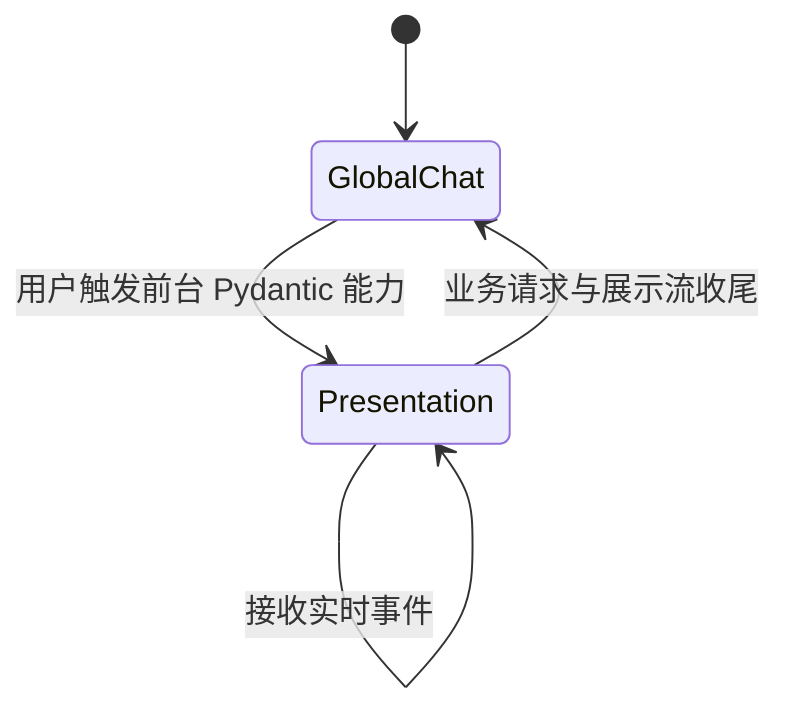
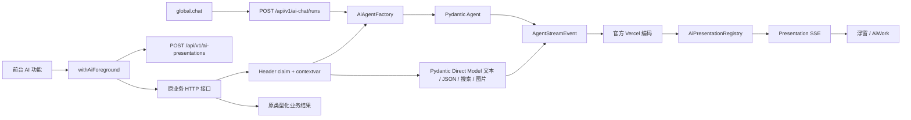

# AiWork 对话与前台 Pydantic 实时展示

> 状态：当前有效契约（2026-09-03）。
>
> 本文已合并旧的浮窗接管方案、通用 Pydantic Agent 可观测层重构计划和实施文档；历史推导、迁移步骤及重复测试细节不再保留。
>
> 当前覆盖范围：`global.chat`、用户直接触发的前台 Pydantic Agent，以及通过统一 Direct Model 边界运行的文本、JSON、联网搜索和图片请求。

## 1. 产品目标

AiWork 浮窗是当前标签页的 AI 活动入口：

- 默认展示可输入的全局聊天 `global.chat`。
- 用户点击类目匹配、AI 填充属性或 AI 模型能力测试等前台能力后，对应 presentation 临时接管浮窗，只读展示 Pydantic 的文字、思考和工具事件。
- 业务请求结束后，浮窗恢复原全局聊天；全局聊天的 conversation、消息、输入和活动流不得被覆盖或重建。
- 点击浮窗时在当前标签页导航到 AiWork 页面，并继续观看同一实时流；运行结束后切换为服务端历史。
- 业务结果始终来自原业务接口，实时消息只用于展示。



## 2. 当前架构



核心模块：

| 层 | Owner | 职责 |
| --- | --- | --- |
| Agent 执行 | `AiAgentFactory` | 统一装配、同步/流式运行、历史保存和 native event 输出 |
| Direct Model 执行 | `ai_direct_request_service.py` | 非 Agent 模型请求；绑定 presentation 时输出原生流事件并保存官方消息历史 |
| 展示上下文 | `ai_presentation_context.py` | contextvar、root/child 关系和 observer 协议 |
| 展示状态 | `AiPresentationRegistry` | reservation、claim、单 lease、短期 chunk 缓冲和终态 |
| 展示转换 | `ai_presentation_service.py` | 将 Pydantic native events 转成官方 Vercel chunk |
| HTTP 边界 | `http_routes.py`、`ai_presentation_routes.py` | claim presentation、绑定上下文、提供 reserve/status/stream |
| 前端传输 | `aiPresentations.ts`、`withAiForeground.ts` | reserve、观察 SSE、调用原业务接口和恢复浮窗 |
| 前端显示 | `AiWorkDisplayStore` | 在 global chat 与 presentation 之间切换 |

## 3. 必须保持的边界

### 3.1 业务与展示分离

- presentation 只观察运行，不启动业务、不选择 model、prompt、ToolSet 或权限。
- 不提供客户端可指定 `use_case_id` 的万能 Agent 执行接口。
- 类目候选、属性修改和其他类型化结果只由原业务接口返回；不得从 assistant 文本或 tool card 反解业务结果。
- SSE 失败不得改变业务成功；SSE 正常也不得掩盖业务失败。

### 3.2 消息事实唯一

- Pydantic `ModelMessage[]` 由 `PydanticMessageStore` 持久化，是规范消息事实。
- `UIMessage[]` 由官方 Adapter 派生或保存在当前前端 `Chat` 内存中，不单独持久化。
- registry 只保存短期官方 SSE chunk 和展示元数据，不保存业务结果或第二份消息历史。
- presentation root Agent 使用预留的 `conversation_id`，实时流与完成后历史必须指向同一 conversation。
- presentation root Direct Model 使用预留的 `conversation_id` 保存官方 `ModelMessage[]`；它仍是 Direct Model 对话，不伪报 Agent run。能力探测的最终通过/失败结论仍由业务响应裁定。

### 3.3 一个前台交互只有一个根流

- 一次 presentation 只能 claim 一次，并且最多有一个活动 SSE lease。
- 同一请求中第一个进入 `AiAgentFactory` 的 Agent，或首个启用展示的 Direct Model 请求，原子领取 root run；后续顺序运行不得创建第二条根流。
- child 继承 presentation observer，但不创建第二条前端 SSE；当前只展示紧凑工具/子运行状态。
- 没有 presentation context 的后台 Agent 正常执行和保存历史，但不抢占浮窗、不建立 presentation SSE。
- Global Agent 调用业务 Agent 时，子 Agent 复用父级展示链，不自行连接前端。

## 4. 前台能力执行流程

1. `withAiForeground()` 在当前标签页原子占用前台展示，拒绝并发的第二次触发。
2. 前端调用 `POST /api/v1/ai-presentations` 预留 presentation，取得服务端生成的 `presentation_id` 与 `conversation_id`。
3. 前端创建只读 observe `Chat`，开始连接 presentation stream。
4. 原业务请求与观察流并发启动；业务请求通过 `X-AI-Presentation-ID` 关联 presentation。
5. HTTP 公共边界 claim reservation，并通过 contextvar 把展示上下文传给业务调用链。
6. `AiAgentFactory` 或统一 Direct Model 边界自动领取 root run，将 Pydantic native events 旁路发布到 registry，同时保持原业务输出与规范历史。
7. 原业务接口返回类型化结果；HTTP 边界关闭 presentation，前端有界等待展示流收尾。
8. 浮窗恢复 `global.chat`；AiWork 页面继续展示该 conversation 的只读历史。

无 Agent 的规则路径或提前返回路径也必须确定关闭 presentation，不得永久显示“等待事件”。浏览器断开观察流只释放 lease，不取消业务请求。

## 5. HTTP 契约

| 方法 | 路径 | 用途 |
| --- | --- | --- |
| `POST` | `/api/v1/ai-chat/runs` | global.chat 的请求型 SSE |
| `POST` | `/api/v1/ai-presentations` | 预留一次前台展示，不启动 Agent |
| `GET` | `/api/v1/ai-presentations/{id}` | 读取展示元数据，不返回业务结果 |
| `GET` | `/api/v1/ai-presentations/{id}/stream` | 观察官方 Vercel SSE；单 lease，可重放短期缓冲 |
| `POST` | 原 focused 业务接口 | 启动业务并返回原类型化结果，通过 header 关联 presentation |

presentation 状态为 `reserved → bound → running → finalizing → completed/failed`；未及时 claim 的 reservation 进入 `expired`。状态只描述展示生命周期，不替代业务 response。

## 6. 前端接入新能力

如果业务已经通过 `AiAgentFactory` 或统一 Direct Model 边界运行，通常只需在用户直接触发的前端 action 外包一层：

```ts
return withAiForeground(
  {
    displayTitle: 'AI 功能名称',
    initialUserMessage: '向用户说明本次操作的真实输入',
  },
  ({ presentationId }) => existingBusinessApi(payload, { presentationId }),
)
```

传输层把 `presentationId` 转为 `X-AI-Presentation-ID`，不得把它混入业务 JSON。后端 Agent service、prompt、ToolSet 和业务 response shape 不应因实时展示而修改，也不应增加业务专用 start/result/SSE 接口。

以下情况不会获得当前 presentation 实时流：

- CLI/Browser 连接（它们不是 Pydantic API Model）；
- 没有使用 `withAiForeground()` 的后台或非前台业务请求；
- 明确用于中间校验、不允许占用 root stream 的内部 Direct 请求。

## 7. 当前范围与待处理项

已接入：

- global.chat 实时对话与历史；
- 类目匹配；
- AI 填充类目属性；
- 单个/批量商品文案生成和本地化改写；
- 图生图、图片翻译/重绘；
- 候选类目与平台属性翻译；
- 产品调研 AI 联网搜索和 AI 搜索 Provider 手动测试；
- AI 模型 chat/JSON/联网/Function Call 等文本能力探测的真实模型输出；其中 chat
  探测发送最小用户消息 `hello`，收到任意非空文本即通过；JSON 探测只要求返回
  可解析的 JSON object，不再混入数组运算或严格字段匹配。所有能力测试都会在展示
  流开始前显示对应的 user 消息；
- 浮窗临时接管、AiWork 同流导航和完成后历史收敛。

当前未覆盖：

- CLI/Browser 模型连接的 Pydantic native-event 实时展示；
- 多个 foreground presentation 并发展示；
- 多进程/多 worker 共享 registry；
- 页面刷新后自动恢复活动 presentation；
- child Agent 的完整独立消息流；
- Global Task 审批卡的跨页面恢复与多窗口一致性。

HTTP 公共边界记录最终响应状态：正常返回的 4xx/5xx 将 presentation 标记为 `failed`；“200 + 业务判断失败”仍按成功完成请求处理，以保持业务判断结果与请求/基础设施失败的区别。

## 8. 验收标准

- 默认浮窗可以继续 global.chat，流式过程中导航到 AiWork 不重建或中断 `Chat`。
- 类目匹配、属性填充、文案、翻译、图片和产品调研的手动 AI 操作使用同一个 presentation 协议，并显示首次 user 输入。
- 专用 Images API 无供应商实时增量时，先完成非流式图片请求，再通过 Pydantic `CompletedStreamedResponse` 向 presentation 重放官方响应事件。
- AI 模型能力测试沿用同一 presentation 协议；Pydantic Direct Model 的真实文本增量可在浮窗查看，业务判定仍来自 `/api/test-ai-model` 响应。
- presentation 接管期间 global.chat 的消息、输入和连接保持不变，业务收尾后恢复。
- 业务 response 是唯一结果事实，展示连接故障不改变业务结果。
- root conversation 与持久化历史 ID 一致；同一请求最多一个 root stream；child 不建立第二条 SSE。
- presentation root Direct Model 的请求与响应使用官方 `ModelMessage[]` 持久化，完成后可从 AiWork 历史重新打开。
- `run_sync()` 与流式运行共享统一 native-event 执行内核；需审批写工具只走 Global Task。
- 无 Agent 路径、业务失败、观察断连和缓冲溢出都能确定收尾。
- 新增一个基于 `AiAgentFactory` 的前台能力时，不增加业务专用 SSE、run facade 或 result endpoint。
- 旧 category-specific run 协议和自研 UI 消息投影无生产代码残留。

回归命令：

```bash
.venv/bin/python -m pytest tests -q
cd front
pnpm test:run
pnpm typecheck
pnpm lint:check
pnpm build
```
