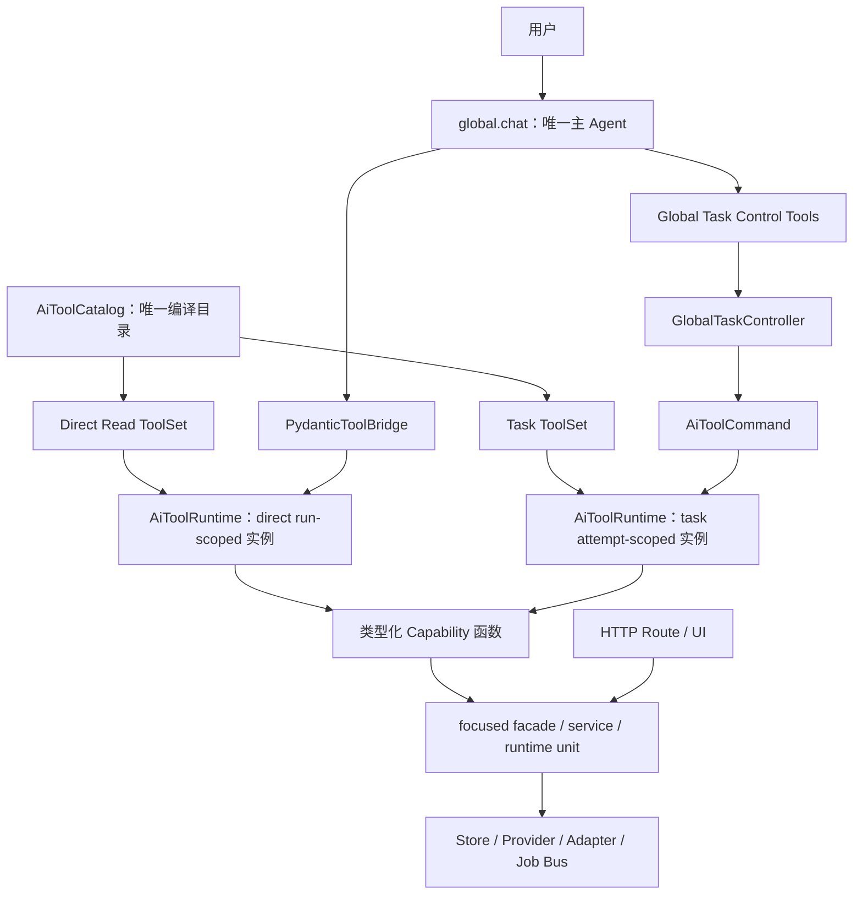

# 单主 Agent 与全业务 Capability 化实施计划（已完成）

> 状态：已实施基线记录（2026-08-18）。
>
> 本文记录的“单主 Agent + 全业务 Capability 化”已经完成实施，是后续 AI
> 重构的现行代码基线，不是本轮待实施计划。
>
> 后续的
> [Pydantic AI Deferred Tools 与 Global Task 恢复链路增量重构计划](pydantic-ai-global-task-deferred-migration-plan.md)
> 是建立在该基线之上的增量修复，不会重做 Catalog、类型化 Request/Result、
> 单主 Agent 或 Capability 执行边界。它只取代本文中有关 Global Task 的 Agent
> 等待、审批暂停、长任务恢复和主对话回传生命周期的设计；本文对应段落不再作为
> 该生命周期链路的实施依据。
>
> 本文当时的实施范围是：
>
> 1. `global.chat` 成为唯一主 Agent、唯一对话入口和唯一全局 AI 模型绑定；
> 2. 所有面向用户的业务功能完成 Capability 化，并复用现有 Pydantic
>    编译链自动生成 Schema、executor、校验和依赖注入。

## 1. 当前阶段的最终目标

### 1.1 唯一主 Agent

- 生产环境只保留 `global.chat`。
- 删除独立 `global.task.plan` Agent、Prompt、Execution Profile、模型绑定和 planning ToolSet。
- 用户问答、补充资料、创建任务、查询任务和确认高风险操作都发生在同一会话。
- 任务计划通过类型化 `global_task_start` Tool 参数产生，不再触发第二次 Planner 模型调用。
- `GlobalTaskController` 继续负责状态持久化、顺序执行、恢复、幂等、审批和长任务终态。
- focused Agent 只作为某项 Capability 的内部实现，不是第二个主 Agent，不拥有任意写权限。

### 1.2 全业务 Capability 化

这里的“所有功能”指所有面向用户、具有独立业务意义的功能，不是所有 HTTP
endpoint、内部 helper 或基础设施接口。

当前阶段完成后必须满足：

- 每个用户业务意图都有稳定 Capability ID；
- 每个 Capability 都有 Pydantic Request 和 Result；
- Schema、输入校验、输出校验、可信依赖注入和机械 executor 由现有
  `AiToolCompiler` 自动生成；
- 每个 Capability 都明确声明可进入 Direct、Task 哪些执行入口，以及自身的副作用、
  审批、幂等和恢复属性；
- 每个现有 HTTP 入口都被覆盖清单分类，不允许存在 `unclassified`；
- HTTP、全局 Agent 和 Global Task 复用同一业务实现，不复制领域逻辑；
- 不把基础设施、密钥、OAuth callback、webhook 或 debug 接口包装成 AI Capability。

目标不是“一接口一个 Tool”，而是“所有业务功能都有一个可治理的 Capability”。
多个 HTTP endpoint 可以映射到同一个 Capability，一个复合 Capability 也可以编排多个
focused service。

## 2. 当前代码事实与真正需要重构的部分

### 2.1 已经具备的自动化基础

项目已经完成了重要的 Pydantic Tool 基础设施，不应重新建设：

- `@ai_tool` 只附加不可变名称、权限、副作用、审批、幂等和版本元数据；
- `AiToolCompiler` 要求唯一模型可见 `request: BaseModel` 和
  `-> BaseModel` 返回值；
- Pydantic 自动生成 input/output JSON Schema；
- `Annotated[T, Injected()]` 参数不会进入模型 Schema，由可信 Binding Scope 注入；
- `CompiledAiTool.bind_executor()` 自动完成输入校验、依赖注入、函数调用、
  输出校验和 JSON 序列化；
- `AiToolCatalog.bind()` 自动检查 allowlist、权限、写入开关和幂等声明；
- `AiToolRuntime` 已负责调用预算、deadline、调用去重和稳定错误结果。

因此，不允许再为每个 Capability 手写 executor adapter，也不允许建立第二套
Schema compiler 或 Tool runtime。

### 2.2 现有领域函数已经具备较好的类型基础

以下现有函数已经采用 Pydantic Request/Result，具备直接 Capability 化的基础：

- `read_product`
- `update_product_attributes`
- `prepare_product_images`
- `match_category`
- `fill_product_attributes`
- `prepare_draft_for_market`
- `validate_product_publish`
- `request_product_publish`

它们当前主要差在：

- 业务依赖仍通过普通 keyword argument 传入，而不是统一的 `Injected Scope`；
- 部分函数尚未声明 `@ai_tool` 元数据；
- 尚未进入应用级 `AiToolCatalog` 组合实例；
- Global Task 没有直接复用编译结果。

### 2.3 当前最大重复在 Global Task

当前 `global_agent_facade.py::_build_base_capabilities()` 为每个任务能力手工完成：

- 从 `LocalTaskStep.inputs` 读取无类型字典；
- 手工补 `task.product_id`、`task.platform` 等上下文；
- 手工构造 Pydantic Request；
- 手工捕获和转换业务异常；
- 手工包装 `CapabilityResult`；
- 手工声明 handler 与 recovery policy。

这与 `AiToolCompiler` 已有的输入适配、依赖注入、调用和输出适配重复。当前阶段必须删除
这层逐 Capability adapter，不能在新能力上继续复制。

### 2.4 当前覆盖不完整

目前生产 `@ai_tool` 只覆盖少量工具，Global Task 也只有九项静态 Capability。
商品、采集、类目、文案、图片、翻译、定价、UPC、研究、平台查询、发布日志和物流等
大量现有业务功能尚未进入统一 Catalog。

现有方案没有逐个 `HANDLED_PATHS` 分类，因此不能证明“所有适合的业务功能都可以由全局
Agent 使用”。

## 3. 目标架构



关键边界：

- `global.chat` 只负责理解完整对话、直接读取事实和提交任务；
- 应用级总目录只是现有 `AiToolCatalog` 的显式组合实例，不引入新的 Catalog 类型；
- Direct ToolSet 与 Task ToolSet 从同一个编译目录投影并绑定；
- Agent 通过 `PydanticToolBridge`、Task 通过 `AiToolCommand` 进入同一套
  `AiToolRuntime.execute()` 实现与结果协议；
- Direct 与 Task 不共享 Runtime 实例：前者按 Agent run 创建，后者按 task attempt
  创建，避免调用缓存、deadline、权限和执行上下文跨边界污染；
- `GlobalTaskController` 不解析领域参数、不调用专用 runner，只管理任务状态并提交命令；
- HTTP 可以继续存在，但与 AI 复用同一 focused service，不通过 HTTP 回调自身；
- ProductStore、平台 Adapter、Browser 和底层 Provider 不直接暴露给主 Agent。

## 4. Capability 的唯一类型化契约

### 4.1 标准函数签名

所有可以进入 Catalog 的 Capability 必须收敛为：

```python
@ai_tool(
    name="product_read",
    description="读取可信商品事实",
    permission="product.read",
    side_effect="none",
    execution_mode="sync",
    recovery_policy="retry_safe",
    version="1",
)
def product_read(
    request: ProductReadRequest,
    scope: Annotated[ProductCapabilityScope, Injected()],
    execution: Annotated[AiExecutionContext, Injected()],
) -> ProductReadResult:
    return read_product(
        request,
        product_store=scope.products,
    )
```

要求：

- 模型可见参数只能是一个 `request`；
- Request 和 Result 必须继承 Pydantic `BaseModel`；
- Pydantic Model 必须 `extra="forbid"`；
- tenant、actor、store、repository、ledger、job bus 和 deadline 必须通过
  `Injected` 提供；
- 模型不能传入或覆盖 Injected 参数；
- Capability 返回业务 Result，不返回随意字典；
- 写能力必须声明 side effect、是否审批和稳定幂等键；
- 业务函数内部继续依赖 focused service，不把领域逻辑写进 decorator、Catalog 或 Controller。

### 4.2 允许的边界函数

如果现有领域函数已经符合 `request -> result` 类型契约，可以直接声明元数据并进入
Catalog。

如果现有函数不适合直接添加 AI 元数据，可以保留一个 Capability boundary function，
但它只能：

- 接收 Pydantic Request；
- 使用 Injected Scope；
- 调用一个 focused service；
- 返回 Pydantic Result。

它不能再次实现：

- JSON Schema 生成；
- 字典到 Request 的手工转换；
- 通用输入/输出校验；
- executor；
- 权限判断；
- 幂等校验；
- 通用异常包装。

这些机械行为只能由现有 Compiler、Catalog 和 Runtime 负责。

### 4.3 统一命名

`@ai_tool` 当前只接受字母、数字、下划线和连字符。新的稳定 Capability ID 统一采用
`snake_case`：

- `product_read`
- `source_collect`
- `category_match`
- `product_attributes_update`
- `product_publish_validate`
- `product_publish_request`

当前 Global Task 使用的 `product.read`、`category.match` 等 dotted name 在迁移后删除，
不保留 alias 或双路径。

## 5. 同一 Runtime 实现，两类隔离的调用上下文

### 5.1 直接 Tool

适合短时间、受限、无副作用的读取或纯计算：

- 编译后的 Capability 加入 `global.chat` direct allowlist；
- `AiToolCatalog.bind()` 生成 run-scoped ToolSet；
- 每次 Agent run 创建与该 ToolSet、Binding Scope 对应的 `AiToolRuntime` 实例；
- `PydanticToolBridge` 把模型调用转换成 `AiToolCommand`；
- `AiToolRuntime.execute()` 完成真实执行，主 Agent 根据结果回答。

典型能力包括商品/草稿读取、类目查询、定价、发布预览、平台商品/订单查询、日志状态和物流预览。

### 5.2 Task Capability

写入、长任务、可恢复工作和需要审批的能力不直接加入主 Agent ToolSet。
`global.chat` 只调用：

- `global_task_start`
- `global_task_get`
- `global_task_submit_input`
- `global_task_cancel`

审批与拒绝不是模型工具：`pending_approval` 任务只能由受信 UI 通过
`/api/global-task-approve` / `/api/global-task-reject` 处理，并在请求头出示只经
`/api/state` 下发的审批会话 token；服务端从校验通过的 token 派生审批人身份，
模型无法构造有效审批身份，因此不能自批高风险任务（见再验收整改 P1-1）。

`global_task_start` 的模型可见 Schema 不能退化成
`capability_name + dict[str, Any]`。它必须从 Task ToolSet 中每个
`CompiledAiTool` 的 `request_type` 自动投影为带 `capability_name` discriminator 的
Pydantic union，使模型看到每种 Task Capability 的真实参数 Schema。这个 union 是
Catalog 的机械 Schema 投影，不允许逐 Capability 手写 step model 或参数转换器。

当前 `AiToolCompiler` 的受限 JSON Schema 子集尚不支持这种 union 所需的
`oneOf/discriminator`。实施时扩展现有 `_compile_schema()`，只接受可判别、分支名称唯一、
各分支仍为 `extra="forbid"` object 的有限 union；继续拒绝任意复杂 union、递归引用和
无法由 Runtime 等价校验的 Schema。这里扩展的是现有唯一 Compiler，不增加 Task Schema
compiler。

请求进入可信边界后，Controller：

1. 在持久化前使用对应 `CompiledAiTool.request_adapter` 校验 `arguments`；
2. 为本次 attempt 创建可信 `AiExecutionContext`、Task ToolSet 和独立
   `AiToolRuntime` 实例；
3. 构造 `AiToolCommand`；
4. 直接调用现有 `AiToolRuntime.execute()`；
5. 把统一 `AiToolResult` 映射到 Task 状态。

这里没有 Task 专用 executor、runner 或 handler map。

### 5.3 扩展现有 Capability 元数据，不创建 Task Spec

任务恢复属性属于 Capability 的执行契约，应扩展现有 `AiToolMetadata`、
`AiToolDefinition` 和 Compiler：

```text
execution_mode: sync / persistent_job
recovery_policy: manual / retry_safe / idempotent
```

以下现有字段继续作为唯一事实源：

```text
side_effect
approval_required
idempotency
idempotency_keys
required_permission
version
input_schema
output_schema
```

不新增 `GlobalTaskCapabilitySpec`。执行方式、恢复、权限、副作用、审批、幂等、版本和
Schema 都从同一个 `CompiledAiTool.definition` 读取。

业务先后约束不写进 Controller 的 Capability 名称分支。应由高层复合 Capability、
领域 service 的前置条件或通用审批协议保证。例如发布请求必须自行验证校验 digest，
而不是由 Controller 判断前一步名称是否为 `product_publish_validate`。

### 5.4 通用 Task 状态与结果协议

Task step 只保存：

```text
capability_name
capability_version
arguments
operation_key
status
result
error
```

Task 顶层使用通用：

```text
pending_approval
active_job
```

删除发布专用 `publish_confirmation`、`publish_idempotency_key`、`publish_job_id` 和
`waiting_publish_result` 语义。其他发布事实保留在通用 approval/job payload 中。

Controller 只按标准结果协议转换状态：

| Runtime/Capability 结果 | Task 状态 |
| --- | --- |
| 正常 `AiToolResult.ok` | `completed` |
| 标准待补资料错误 | `needs_input` |
| `TOOL_APPROVAL_REQUIRED` + 服务端审批快照 | `pending_approval` |
| `JobReferenceResult` | `in_progress` |
| 其他稳定错误 | `failed` |

审批展示与执行绑定都由服务端快照派生（再验收整改 P1-2）：审批能力声明
`approval_snapshot(request, scope) -> TaskApprovalSnapshot`，Controller 在生成
`pending_approval` 与执行复核两个时点分别重算；模型可见 request schema 不含任何
`approval` 字段，模型不能提交最终用于展示的摘要。审批 digest 绑定冻结参数、步骤 ID、
任务 revision 与 capability 名称/版本；批准后把可信 digest 与任务版本放入新的
`AiExecutionContext`，Capability 执行时重算快照并经 `verify_execution_approval` 复核，
用原 `operation_key` 再次执行同一个命令。长任务由 Capability 同步提交持久化 Job 并返回
类型化 `JobReferenceResult`，Controller 只根据通用 `active_job` 与按 `job_type` 注册的
通用 Job Status Reader 查询终态，不直接依赖领域模块。

超时契约（再验收整改 P1-4）：进行同步阻塞 I/O 的 Capability 必须接收注入的
`AiExecutionContext`，并把 `execution.bounded_timeout_seconds()` 传给底层 HTTP/SDK
调用，使内层 deadline 受外层剩余时间约束；外层剩余时间短于内层默认值时实际采用外层
剩余时间。副作用已经发出后发生的任何异常（含超时）不得包装为可自动重试的普通失败，
而要以 `details.outcome_unknown` 上报；Controller 据此把步骤记录为结果未知并禁止自动
重试。无法在短时限内可靠完成的能力改为 `execution_mode="persistent_job"`，返回 Job
引用并在进程重启后经 Job Status Reader 继续查询终态。

任务创建时从 `CompiledAiTool.definition.version` 冻结 `capability_version`。恢复前必须
确认 Catalog 中仍存在同名同版本定义；版本不一致时以稳定错误码进入 `failed`，要求用户
基于新版本重新创建任务，不能静默用新语义重放旧步骤。approval digest 同时绑定
Capability 名称和版本。

Controller、Runtime 和 Task schema 中禁止出现：

```python
if capability_name == "某个具体业务能力":
    ...
```

如果某个新能力要求修改 Controller 才能运行，说明通用协议仍不完整，应先完善协议，
不能添加业务名称分支。

## 6. Catalog、allowlist 与覆盖清单

### 6.1 现有 AiToolCatalog 的应用级组合

不新增 `ApplicationCapabilityCatalog` 类。在 focused composition root 中显式组合函数并
创建现有 `AiToolCatalog` 的唯一应用级实例：

```python
ALL_AI_CAPABILITIES = (
    *PRODUCT_CAPABILITIES,
    *COLLECTION_CAPABILITIES,
    *CATEGORY_CAPABILITIES,
    *PUBLISH_CAPABILITIES,
)

APPLICATION_CAPABILITY_CATALOG = AiToolCatalog.compile(ALL_AI_CAPABILITIES)
```

要求：

- 由各领域明确导出的 Capability tuple 组合；
- 使用 `AiToolCatalog.compile()` 编译；
- 禁止扫描包；
- 禁止依赖 import side effect 注册；
- 禁止在运行时动态发现任意函数；
- Capability 名称冲突在启动和测试阶段失败。

建议按领域维护：

```text
PRODUCT_CAPABILITIES
COLLECTION_CAPABILITIES
CATEGORY_CAPABILITIES
CONTENT_CAPABILITIES
IMAGE_CAPABILITIES
PUBLISH_CAPABILITIES
MARKETPLACE_CAPABILITIES
RESEARCH_CAPABILITIES
LOGISTICS_CAPABILITIES
```

总 Catalog 只做显式组合，不反向依赖 HTTP route，不包装或代理现有 `AiToolCatalog`。

### 6.2 Capability Exposure

使用不可变名称集合从同一个 Catalog 投影 ToolSet，不新增 Exposure 执行框架：

| 集合 | 含义 |
| --- | --- |
| `GLOBAL_CHAT_DIRECT_CAPABILITIES` | 主 Agent 可直接调用的只读/纯计算能力 |
| `GLOBAL_TASK_CAPABILITIES` | 可以作为 Global Task step 执行的能力 |
| `INTERNAL_ONLY_CAPABILITIES` | 仅供其他 Capability/focused Agent 内部使用 |

Direct 与 Task 集合允许重叠。例如 `product_read` 可以被主 Agent 直接读取，也可以作为
持久化任务的一步。`approval_required` 是 Capability 契约元数据，不是第四种 Exposure；
需要审批的任务就是 `GLOBAL_TASK_CAPABILITIES` 成员且
`definition.approval_required=True`。

每个 Catalog Capability 至少进入 Direct、Task 或 Internal 之一；Internal 与前两者互斥。
这条覆盖关系由架构测试验证，不再维护另一份 exposure enum 或 spec。

基础设施 endpoint 使用 `excluded` 分类，但它不是 Capability。

allowlist 只是已经编译能力的暴露开关：

- 新能力没有进入 Catalog 时，修改 allowlist 必须失败；
- direct allowlist 不能包含 write Capability；
- Task allowlist 只能引用已编译且声明 execution/recovery metadata 的能力；
- `global_task_start` 的 discriminated union 必须与 Task allowlist 同源生成；
- `global.chat` 的模型绑定界面只显示一个功能，不为每个 Capability 创建模型绑定。

### 6.3 Endpoint Coverage Manifest

新增静态 `AiCapabilityCoverageManifest`，对每个
`erp_web/http_route_units/*::HANDLED_PATHS` 分类：

```text
method
path / dynamic path family
business_domain
disposition
capability_names
reason（internal_only / excluded 时必填）
```

Manifest 只用于覆盖治理，不驱动运行时路由，不允许 Catalog 反向依赖 HTTP。

架构测试必须：

1. 汇总所有 `HANDLED_PATHS`；
2. 与 Coverage Manifest 比较；
3. 新 endpoint 未分类时失败；
4. Manifest 引用不存在的 Capability 时失败；
5. 同一 endpoint 的重复或冲突分类失败；
6. `excluded` 没有理由时失败。

最终要求是“零 unclassified”，不是“零 excluded”。

## 7. 全业务功能的初始覆盖分类

下表是当前阶段的领域级迁移范围。实施时以 Endpoint Coverage Manifest 的逐入口结果为准。

| 业务域 | Capability 化范围 | 默认暴露 |
| --- | --- | --- |
| 商品与草稿 | 查询、读取、保存、更新、删除、目标市场草稿准备 | 读为 direct + task；写为 task；删除额外要求 approval |
| 采集与认领 | source collect、batch collect、browser-tab 导入、目标平台认领 | task |
| 类目与属性 | 类目搜索、匹配、属性定义/枚举查询、预检、AI 填充、属性更新 | 查询 direct；修改 task |
| 文案与翻译 | 单品/批量文案、图片提示词、文本翻译 | 预览 direct；生成与批量 task |
| 图片 | 图片池读取、选择、保存、同步、上传 artifact 引用、翻译和编辑 | 读 direct；修改/生成 task |
| 定价与 UPC | 定价计算、UPC 分配和导入 | 计算 direct；分配/导入 task |
| 发布 | 发布校验、payload 预览、提交发布、真实终态、关闭远端商品 | 校验/预览 direct + task；发布和关闭为 task + approval |
| 平台商品与订单 | 已发布商品、订单、发布日志、队列和 job 状态 | direct |
| 商品研究 | 创建研究任务、查询状态和结果 | start 为 task；查询 direct |
| 物流 | 运单预览、创建真实运单 | 预览 direct + task；创建为 task + approval |
| 店铺授权状态 | 脱敏 checklist、授权是否有效 | direct |

以下入口必须分类为 `excluded`，不包装为 AI Capability：

- AI config 保存、模型探测和 Provider 测试；
- OAuth code/token 交换、refresh token、原始密钥读写；
- webhook/notification 接收；
- Browser debug、打开本地 profile、任意 URL；
- extension payload 接收和原始上传协议；
- conversation、presentation、SSE 和 chat transport；
- health/state/static page 等协议或聚合基础设施；
- 原始 SQL、通用 ProductStore patch、任意 HTTP 和 shell；
- source registry 管理等管理员配置入口，除非以后单独设计审批能力。

“被排除”不代表功能被删除；只是它继续由受信 UI、外部平台或内部系统调用，不能由模型发起。

## 8. 当前阶段实施顺序

### Workstream A：统一 Capability 编译与任务执行

1. 扩展现有 `AiToolMetadata`、`AiToolDefinition` 和 Compiler，加入
   `execution_mode`、`recovery_policy`，不建立 Task metadata 副本。
2. 扩展现有 Compiler 的受限 Schema 子集，使其可以编译并等价校验 Task step 的
   discriminated union；不增加第二个 Schema compiler。
3. 用现有 `AiToolCatalog.compile()` 创建唯一应用级 Catalog 实例，并从中绑定
   Direct ToolSet 与 Task ToolSet。
4. 从 Task ToolSet 的 Pydantic Request 自动投影 `global_task_start` discriminated
   union；不得手写各 Capability 的 step 参数类型。
5. Task step 将 `inputs` 收敛为经过 Catalog 校验的规范化 `arguments`。
6. Controller 在创建任务持久化前，用目标 Capability 的
   `request_adapter` 校验每一步，并冻结 `definition.version`。
7. Controller 为每次 attempt 创建 `AiExecutionContext` 与独立 `AiToolRuntime`
   实例，构造 `AiToolCommand` 并直接调用 `AiToolRuntime.execute()`。
8. 将 Task state 收敛为通用 `pending_approval`、`active_job` 和标准结果映射。
9. 统一 Scope provider、业务错误、`needs_input`、approval 和 JobReference 转换。
10. 删除 `_build_base_capabilities()` 的逐项 handler、发布专用状态和业务名称分支。

验收：

- Task 路径不再手工构造领域 Request；
- input/output Schema 只来自 Pydantic；
- `global_task_start` 向模型暴露的是各 Task Request 的真实 union Schema，不是任意字典；
- direct Tool 与 Task 都通过现有 `AiToolRuntime.execute()` 实现执行，但不共享
  run-scoped Runtime 实例；
- 没有新增 Task Runtime、Runner、Spec 或 executor map；
- Controller 和 Task schema 不包含任何具体 Capability 名称判断；
- 新增同步 Capability 不需要编写 executor。

### Workstream B：只保留 `global.chat`

1. `global.chat` 接入 Direct Read ToolSet 和 Global Task Control ToolSet。
2. 增加类型化 `global_task_start`，由 Chat 提交已经选择好的步骤和参数。
3. Controller 删除 `planner` dependency 和 `planning` 状态。
4. 删除 Planner 的 answer/ask_user/plan 分支；Chat 自己回答或询问。
5. 删除 `global.task.plan` use case、Prompt、budget、Execution Profile 和模型 binding。
6. 功能绑定 UI 只显示一张“全局 AI”，稳定 ID 为 `global.chat`。
7. 删除 goal → Planner 的旧 `/api/global-task-start` 入口；Task 状态、补资料、
   取消和审批的受信 UI 接口按需要保留。
8. conversation/message ID 进入可信 Task Scope 和幂等上下文，但 Task 恢复不依赖聊天历史。

验收：

- 一次用户消息最多产生一个 root Agent run；
- 创建任务不触发第二次 Planner 模型请求；
- 系统中不存在 `global.task.plan` 生产绑定；
- focused Agent 不创建第二条用户 presentation/SSE。

### Workstream C：迁移现有九项任务能力

优先用现有九项做纵向验证：

```text
drafts_query
draft_prepare_for_market
product_read
category_match
product_attributes_fill
product_attributes_update
product_images_prepare
product_publish_validate
product_publish_request
```

每项迁移要求：

1. 复用现有 Pydantic Request/Result；
2. 将业务依赖收敛为 typed Injected Scope；
3. 声明 `@ai_tool` 元数据；
4. 加入统一 Catalog；
5. execution/recovery 写入同一 `@ai_tool` metadata，并加入 Direct、Task 或 Internal
   名称集合；
6. 删除旧 dotted name 和手写 Task handler；
7. HTTP 与 Task 的行为测试指向同一个 focused service。

验收：九项能力全部由编译器生成 Schema/executor，现有任务恢复、发布幂等和确认行为不退化。

### Workstream D：覆盖全部现有业务域

按风险而不是按 route 文件顺序迁移：

1. 第一批：只读、查询、预览和纯计算；
2. 第二批：普通本地写入和可安全重试任务；
3. 第三批：批量、图片、研究和外部长任务；
4. 第四批：发布、删除、远端关闭和真实运单等审批任务。

每完成一个领域：

- 更新领域 Capability tuple；
- 更新 Direct/Task/Internal 名称集合；
- 更新 Endpoint Coverage Manifest；
- 删除该领域旧 AI 专用旁路；
- 运行 Schema、权限、HTTP/AI 等价性、Task 恢复和副作用测试。

验收：所有当前 `HANDLED_PATHS` 均有唯一分类，所有非 excluded 用户业务功能均映射到至少一个真实编译 Capability。

### Workstream E：删除旧路径与建立守卫

1. 删除重复 `drafts_query` ToolSet。
2. 删除 `GlobalAgentService` 和 Planner-only schema。
3. 删除 `global_task_tools.py`、`global_chat_tools.py`，由统一 Catalog composition 取代。
4. 删除 `DeclaredGlobalTaskCapability` 和逐项 Task handler map。
5. 删除 `publish_confirmation`、`publish_idempotency_key`、`publish_job_id` 和
   Controller 中的发布名称分支，由通用 approval/job 协议取代。
6. 删除只验证 Planner、dotted capability name、手写 adapter 和发布专用状态的测试。
7. 检索旧 profile、Prompt、endpoint、symbol 和配置键，确认无生产残留。
8. 更新 `docs/ai-context-map.md` 和架构测试。

项目处于 Demo 阶段，不保留 feature flag、shadow planner、旧 Capability alias 或 runtime fallback。

## 9. 文件级改造计划

### 9.1 计划新增

- `erp_web/services/ai_capability_composition.py`
- `erp_web/services/ai_capability_coverage.py`
- `erp_web/runtime_units/global_ai_control_tools.py`：包含从 Task ToolSet 自动投影的
  `global_task_start` 请求 Schema 和通用任务控制 Capability；
- `tests/test_ai_capability_coverage.py`

领域 Capability 优先放入已有 focused `*_capabilities.py`；只有职责不清晰时才新增文件。

### 9.2 计划重点修改

- `erp_web/services/ai_tool_declaration.py`、`erp_web/schemas/ai_tools.py`、
  `erp_web/services/ai_tool_compiler.py`：在现有唯一契约中增加 execution/recovery
  metadata，并为自动生成的 Task step 增加受限 discriminated union 支持；不增加第二套
  定义或编译器。
- `erp_web/services/ai_tool_catalog.py`：保持唯一 Catalog 实现，供应用级显式组合实例
  绑定 direct/task ToolSet；不新增 Catalog wrapper/subclass。
- `erp_web/services/ai_tool_runtime.py`：仅补充通用 input、approval、job 结果协议确实
  缺失的部分；不增加 Task 专用 Runtime。
- `erp_web/services/global_agent_chat_service.py`：成为唯一主 Agent service。
- `erp_web/services/global_task_controller.py`：删除 Planner 和手写 Capability
  protocol，直接构造 `AiToolCommand` 并调用现有 `AiToolRuntime`。
- `erp_web/facades/global_agent_facade.py`：删除
  `_build_base_capabilities()`；实施时拆分/重命名为 focused task facade。
- `erp_web/services/vercel_ai_ui_service.py`：传递可信 conversation、message、
  approval 和 idempotency Scope。
- `erp_web/services/ai_model_config.py`：只保留 `global.chat` 全局模型绑定。
- `erp_web/services/ai_prompt_templates.py`：删除 Planner Prompt，向 Chat 提供
  精简的 Task Capability manifest。
- `erp_web/schemas/global_tasks.py`：类型化 Task create、step arguments 和通用
  `pending_approval`、`active_job`；删除发布专用状态。
- 各领域 `schemas/*`、`runtime_units/*_capabilities.py`、focused facade/service。
- `front/src/components/auth/AuthSettingsPanel.vue`：只显示一个全局 AI 绑定。
- task/chat UI、相关文档和架构测试。

### 9.3 计划删除

- `erp_web/services/global_agent_service.py`
- `erp_web/runtime_units/global_task_tools.py`
- `erp_web/services/global_chat_tools.py`
- `GlobalTaskPlanner`、`GlobalTaskPlanningOutcome` 和 Planner-only validator
- `DeclaredGlobalTaskCapability`、`declare_global_task_capability`
- `global_agent_facade.py::_build_base_capabilities()` 及其逐项内部 handler
- `GlobalTaskCapabilitySpec`、`CompiledTaskCapabilityRunner` 或任何等价新增层
- `publish_confirmation`、`publish_idempotency_key`、`publish_job_id` 等发布专用 Task 字段
- `global.task.plan` profile、binding、Prompt、budget 和配置快照
- dotted legacy Capability ID
- goal → Planner 的旧任务创建路径
- 所有只服务旧路径的测试和 mock

## 10. 测试与架构守卫

至少覆盖：

1. 生产 AI use case 和功能绑定中只有 `global.chat`。
2. 代码、配置和 Prompt 中不存在 `global.task.plan`。
3. 每个 Catalog Capability 都能通过 `AiToolCompiler.compile()`。
4. Capability Request/Result 都是 `extra="forbid"` 的 Pydantic Model。
5. Injected 参数不会进入模型 input Schema。
6. Catalog、direct/task/internal 名称集合和 execution/recovery metadata 互相引用完整。
7. direct allowlist 不包含 write Capability。
8. Agent 与 Task 都调用 `AiToolRuntime.execute()`；不存在 Task Runner 或逐 Capability executor map。
9. `global_task_start` 的 discriminated union 与 Task 名称集合一致，并复用每项
   Capability 的 Pydantic Request Schema。
10. Compiler 接受受限 discriminated union，拒绝歧义分支、递归引用和不受支持的
    arbitrary union。
11. Task 创建在持久化前使用目标 Capability request adapter 再次校验 arguments。
12. 写能力缺少 approval/idempotency/execution context 时编译或绑定失败。
13. Controller 不依赖 conversation 历史即可恢复已持久化步骤。
14. Task 恢复拒绝静默执行不同 `capability_version` 的定义。
15. 同一 operation key 重试不产生重复写入。
16. 通用 approval 绑定 task revision、step ID、Capability 名称/版本、operation key 和
    digest；模型不能伪造确认。
17. 通用 `active_job` 可以表示发布、采集、研究、图片和物流 Job，不含业务专用字段。
18. Controller、Runtime、Task schema 中不得按具体 Capability 名称分支。
19. 所有 `HANDLED_PATHS` 在 Coverage Manifest 中恰好分类一次。
20. `excluded` 条目有理由，非 excluded 业务入口引用真实 Capability。
21. HTTP 与 AI/Task 调用同一业务能力时得到等价 Result 和错误码。
22. 新增 route 未分类、新增 Capability 未进入 exposure 名称集合时架构测试失败。
23. 检索旧 Planner、dotted Capability、手写 adapter 和发布专用 Task symbol，确认无残留。
24. 只读（`side_effect="none"`）能力不得写持久化状态、数据库或外部世界；架构测试
    静态扫描其可达源码中的写调用（P1-3）。
25. 进行同步阻塞 I/O 的能力必须把 `execution.bounded_timeout_seconds()` 传给底层调用；
    调用外部平台的写能力在副作用发出后不得声明 `retryable=True`（P1-4）。

回归命令：

```bash
.venv/bin/python -m pytest tests -q
cd front
pnpm test:run
pnpm typecheck
pnpm lint:check
pnpm build
```

## 11. 当前阶段明确不做

以下内容不属于本轮“单主 Agent + 全业务 Capability 化”：

- 改进 1688 Browser selector；
- 给具体采集方式增加 AI DOM/图片解析；
- 统一采集后的 AI 语义审计和定向修复；
- 新增全网搜索生产采集能力；
- 新平台 Adapter；
- 超长会话记忆系统；
- 新的文案、图片或物流产品功能。

现有采集、研究、图片等功能本轮只完成 Capability 化，不改变其领域行为。后续增强时直接复用
本轮建立的 Catalog、Pydantic 契约、统一 `AiToolRuntime` 执行协议和权限体系。

## 12. 完成后的新增能力成本

本轮完成后，新增一个普通能力的标准流程应收敛为：

1. 有现成 Pydantic Request/Result 时直接复用；没有时补齐类型模型。
2. 让 capability function 满足 `request + Injected -> result`。
3. 声明 `@ai_tool` 元数据。
4. 声明 execution/recovery metadata，并加入领域 tuple 与应用级 Catalog 实例。
5. 加入 Direct、Task 或 Internal 名称集合；需要审批只声明
   `approval_required=True`，不创建另一类 Capability。
6. 如果来自新 HTTP 入口，更新 Coverage Manifest。
7. 添加领域行为、权限和暴露测试。

不再需要：

- 手写 JSON Schema；
- 手写 executor；
- 手工把 dict 转成 Pydantic Request；
- 为 Global Task 再包装一套 handler；
- 为每个能力创建模型绑定；
- 为 AI 复制已有 HTTP 或领域逻辑。

真正仍可能产生较大改动的情况只有：原功能本身混合 HTTP、领域逻辑、持久化和外部副作用，
或者缺少可恢复 Job、幂等和审批契约。那是业务边界需要重构，不是 Capability 框架要求重复编码。
