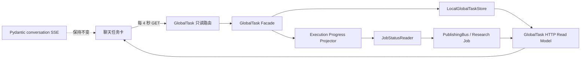

# GlobalTask 执行进度可视化计划

> 状态：设计计划，尚未实施  
> 日期：2026-08-24  
> 范围：GlobalTask 聊天任务卡的只读可观测性

## 1. 背景

GlobalTask 执行持久化 Job 时，聊天任务卡目前只能展示任务级状态、完成步骤数和一条通用说明。PublishingBus 等领域 Job 已经保存了执行阶段、内部步骤、重试次数、最近平台状态和下一次检查时间，但这些信息没有进入 GlobalTask 的 HTTP 读模型，因此用户只能看到长时间不变化的“运行中”。

以 Yandex 发布为例，商品映射、加入店铺、价格和库存写入已经完成后，Job 会继续等待平台确认。后台能够看到 `phase=confirmation`、`retries`、`next_poll_at` 和最近的 `campaign_status`，聊天任务卡却无法区分“正在提交”“等待平台”“退避重试”或“进程失去执行者”。

这不是执行数据缺失，而是当前边界只保留了粗粒度状态：

1. `TaskActiveJob` 只保存 `job_id`、`job_type`、步骤绑定和开始时间。
2. `JobStatusReader` 只把领域 Job 收敛为 `running / success / failed`。
3. GlobalTask HTTP 响应没有独立的执行进度读模型。
4. 聊天任务卡虽每 4 秒读取一次状态，但只能重复渲染同一份粗粒度数据。

## 2. 目标

在不改变 GlobalTask、Pydantic Deferred、Capability 和领域 Job 执行语义的前提下，让聊天任务卡回答以下问题：

- 当前执行第几步，总共多少步？
- 当前正在做什么？
- 已经执行或等待了多少秒？
- 领域 Job 内部哪些子步骤已完成、正在执行或尚未开始？
- 最近一次外部状态是什么？
- 是否正在退避，已经检查或重试多少次，下次何时检查？
- 当前是正常等待、可重试异常，还是已经终结？

## 3. 非目标

本计划不包含以下改动：

- 不改变任务成功、失败、串行或遇错即停的业务规则。
- 不改变 `global_task_start`、Deferred Tool 或 continuation 流程。
- 不把领域进度写入 Pydantic 消息历史。
- 不给现有聊天 SSE 增加自定义业务事件。
- 不增加新的 Agent loop、任务推进协议或前端写刷新入口。
- 不建立完整的历史事件审计系统。
- 不显示伪造的百分比；没有真实分子和分母时只显示阶段和耗时。

## 4. 核心决策

### 4.1 使用计算型只读视图

执行进度是从当前 GlobalTask 和领域 Job 状态即时投影出的只读视图，不写回 `LocalGlobalTaskState`，也不保存进 `task_json`。

这样可以保证：

- GlobalTask 持久化状态仍然只负责任务执行事实。
- 进度读取失败不会影响任务推进。
- GET 请求不触发 CAS、revision 递增或远端调用。
- 现有任务无需数据库迁移即可获得进度展示。

### 4.2 保持 GET 轮询，不接入现有 SSE

聊天任务卡继续每 4 秒调用：

```text
GET /api/v1/global-tasks/<task_id>
```

现有 conversation SSE 继续只承载 Pydantic AI 官方编码事件、Deferred 握手和终结后的 continuation。领域 Job 进度不进入 SSE outbox，也不引入第二套事件协议。

前端耗时数字可在两次 GET 之间每秒本地递增，数据基准仍由服务端响应校正，因此无需为了计时每秒请求后端。

### 4.3 保持 GlobalTask 领域无关

GlobalTaskController 不解析 Yandex、Ozon 或研究任务的专用状态。领域 `JobStatusReader` 负责把专用状态映射为统一的进度快照，任务卡只渲染通用契约。

## 5. 目标数据流



## 6. HTTP 读模型

### 6.1 分离持久化模型与 UI 视图

保留现有 `GlobalTaskResponse` 作为 Controller 和控制 Capability 的领域响应。新增 HTTP/UI 专用响应，例如：

```python
class GlobalTaskExecutionProgress(StrictTaskModel):
    observed_at: datetime
    task_elapsed_seconds: int
    current_step: GlobalTaskCurrentStepProgress | None = None
    active_job: GlobalTaskActiveJobProgress | None = None
    activities: list[GlobalTaskProgressActivity] = Field(default_factory=list)


class GlobalTaskViewResponse(StrictTaskModel):
    ok: Literal[True] = True
    task_id: str
    task: LocalGlobalTaskState
    execution_progress: GlobalTaskExecutionProgress | None = None
```

不得把易变的 `execution_progress` 字段加入持久化的 `LocalGlobalTaskState`。

### 6.2 建议响应形状

```json
{
  "ok": true,
  "task_id": "gtask_example",
  "task": {
    "status": "in_progress",
    "current_step_index": 1,
    "steps": []
  },
  "execution_progress": {
    "observed_at": "2026-08-24T00:13:00+08:00",
    "task_elapsed_seconds": 295,
    "current_step": {
      "index": 1,
      "ordinal": 2,
      "total": 4,
      "capability_name": "product_publish_request",
      "label": "提交商品发布",
      "status": "running"
    },
    "active_job": {
      "job_id": "20260824-000818-a0c86b1a",
      "job_type": "publish",
      "status": "running",
      "stage_code": "waiting_platform_confirmation",
      "stage_label": "等待 Yandex 平台确认",
      "summary": "远端写入已完成，正在确认店铺商品状态",
      "started_at": "2026-08-24T00:08:18+08:00",
      "updated_at": "2026-08-24T00:12:58+08:00",
      "elapsed_seconds": 282,
      "phase_started_at": "2026-08-24T00:08:39+08:00",
      "phase_elapsed_seconds": 261,
      "attempt": 1,
      "retry_count": 7,
      "next_check_at": "2026-08-24T00:13:02+08:00",
      "last_external_status": "CHECKING"
    },
    "activities": [
      {
        "code": "offer_mapping",
        "label": "提交商品资料",
        "status": "completed",
        "completed_at": "2026-08-24T00:08:22+08:00"
      },
      {
        "code": "campaign_offer",
        "label": "加入店铺",
        "status": "completed",
        "completed_at": "2026-08-24T00:08:28+08:00"
      },
      {
        "code": "price",
        "label": "更新价格",
        "status": "completed",
        "completed_at": "2026-08-24T00:08:33+08:00"
      },
      {
        "code": "stock",
        "label": "更新库存",
        "status": "completed",
        "completed_at": "2026-08-24T00:08:39+08:00"
      },
      {
        "code": "confirmation",
        "label": "确认平台状态",
        "status": "running",
        "completed_at": null
      }
    ]
  }
}
```

### 6.3 耗时规则

- 活跃任务总耗时：`observed_at - task.created_at`。
- 终态任务总耗时：`task.updated_at - task.created_at`。
- 活跃 Job 耗时：`observed_at - active_job.started_at`。
- 当前阶段耗时：优先使用 Reader 提供的 `phase_started_at`；缺失时回落为 Job 耗时。
- 所有耗时向下取整为非负整数秒。
- 服务端必须返回 `observed_at`，前端以它为计时锚点，避免本机与服务端时钟偏差。

## 7. 后端实施

### 7.1 新增通用进度 Schema

在 `erp_web/schemas/global_tasks.py` 中增加 HTTP 读模型及以下通用类型：

- `GlobalTaskCurrentStepProgress`
- `GlobalTaskActiveJobProgress`
- `GlobalTaskProgressActivity`
- `GlobalTaskExecutionProgress`
- `GlobalTaskViewResponse`

状态枚举保持小而稳定，例如：

```text
queued / running / waiting / retrying / completed / failed
```

### 7.2 扩展 JobStatusReader 契约

把当前只返回 `status` 和 `error` 的非结构化 Mapping 收敛为类型化快照。Controller 仍只消费生命周期字段，进度投影服务消费可选展示字段。

建议通用字段包括：

- `status`
- `error`
- `stage_code`
- `stage_label`
- `summary`
- `updated_at`
- `attempt`
- `retry_count`
- `next_check_at`
- `last_external_status`
- `phase_started_at`
- `activities`

Reader 没有详细信息时只返回生命周期字段，任务卡必须安全降级。

### 7.3 实现进度投影服务

新增 focused service，例如：

```text
erp_web/services/global_task_progress_service.py
```

职责仅包括：

1. 根据 `LocalGlobalTaskState` 计算当前步骤和任务耗时。
2. 根据 `active_job.job_type` 查找注册的 Reader。
3. 读取已经持久化的 Job 状态。
4. 生成 `GlobalTaskExecutionProgress`。
5. 捕获 Reader 异常并降级为通用运行信息。

它不得推进任务、更新数据库、调用模型或直接依赖平台 API。

### 7.4 映射 PublishingBus 进度

`PublishJobStatusReader` 从 `get_public_status(job_id)` 中读取并白名单映射：

- 平台状态与阶段。
- Job、平台和 checkpoint 更新时间。
- `completed_steps`。
- 当前 `phase`。
- `retries` 和 `next_poll_at`。
- `last_response_summary.status`。
- `evidence` 中经过筛选的完成时间。

Yandex 的内部步骤可映射为：

| 内部 code | 用户可见名称 |
|---|---|
| `offer_mapping` | 提交商品资料 |
| `campaign_offer` | 加入店铺 |
| `price` | 更新价格 |
| `stock` | 更新库存 |
| `confirmation` | 确认平台状态 |

Ozon、Mercado Libre 和 Research Job 使用自己的 Reader 生成同一通用活动结构，不得让前端识别平台专用 checkpoint。

### 7.5 接入 HTTP Facade

`read_global_task_state_payload()` 在读取任务后调用进度投影服务，返回 `GlobalTaskViewResponse`。

审批、补充输入、取消等 HTTP 写响应也应使用相同的 UI 视图包装，避免写操作完成后任务卡短暂丢失进度。Pydantic 控制 Tool 继续使用原领域响应，不引入 UI 字段。

## 8. 前端实施

### 8.1 类型与 API

在 `front/src/types/aiWork.ts` 中增加进度类型，并在 `front/src/api/globalTasks.ts` 中规范化：

- 缺失的进度字段。
- 非法或负数耗时。
- 未知状态和空活动列表。
- ISO 时间字符串。

### 8.2 任务卡布局

任务卡默认展示：

```text
全局任务 · 运行中
发布两个草稿

第 2/4 步：提交商品发布
等待 Yandex 平台确认 · 已耗时 263s
最近状态：CHECKING · 已检查 7 次 · 12s 后再次检查

✓ 提交商品资料
✓ 加入店铺
✓ 更新价格
✓ 更新库存
● 确认平台状态
○ 校验 Ozon 草稿
○ 提交 Ozon 发布
```

展示规则：

- 顶层步骤和 Job 内部活动分层展示，避免混为同一列表。
- 默认使用用户可读名称，原始 code 放在可折叠技术详情中。
- 没有真实进度比例时使用不定进度状态，不显示百分比。
- `aria-live` 只播报阶段或状态变化，不每秒播报耗时。
- 终态后冻结耗时并停止轮询。

### 8.3 本地计时

任务卡收到响应后保存：

- `observed_at`
- 服务端计算的耗时秒数
- 本地接收时间

页面每秒基于本地经过时间刷新显示，下一次 GET 返回后重新校准。浏览器标签页恢复时直接按时间差校准，不累计定时器 tick，避免后台节流造成计时漂移。

## 9. 安全与数据边界

进度响应必须采用字段白名单，不得返回：

- API Token、店铺凭据或授权头。
- 完整商品、草稿或发布 Payload。
- 完整平台原始响应。
- approval digest、幂等事实或内部安全上下文。
- 未限制长度的错误栈或第三方响应正文。

用户可见摘要、阶段名称和外部状态必须限制长度。原始平台枚举可以作为短文本展示，但不能把任意原始对象透传到 UI。

## 10. 失败与降级策略

- `active_job` 为空：只展示 GlobalTask 步骤和任务总耗时。
- Reader 未注册：展示“后台任务正在执行，暂无详细进度”。
- Job 不存在：展示“暂时无法读取后台任务进度”，但不把任务改成失败。
- Reader 读取异常：记录服务端日志，HTTP 仍返回任务主体。
- 领域状态无法映射：展示通用阶段和原始短状态，不猜测业务含义。
- 任务已经终结：以任务终态为准，不再读取活动 Job。

## 11. 测试计划

### 11.1 后端单元测试

- 活跃 GlobalTask 能生成当前步骤和 Job 耗时。
- 终态任务耗时使用 `updated_at - created_at`。
- PublishingBus checkpoint 能映射内部活动、重试和下次检查时间。
- Reader 缺失、Job 缺失和 Reader 异常均能安全降级。
- 负时间差被收敛为 0。
- 响应不包含凭据、Payload 和原始响应。

### 11.2 HTTP 与架构测试

- GET 返回类型化 `execution_progress`。
- 连续 GET 不修改 GlobalTask revision、Job 状态或数据库更新时间。
- 只读路由保持轻薄，不直接导入 runtime unit。
- GlobalTaskController 不新增平台专用判断。
- conversation SSE outbox 不产生业务进度事件。
- Pydantic Deferred 握手和 continuation 行为保持不变。

### 11.3 前端测试

- 正确展示当前步骤、内部活动、最近状态和重试次数。
- 耗时每秒递增并能由新响应校准。
- 终态停止计时和轮询。
- 缺少详细进度时显示降级文案。
- 旧 GET 响应不会覆盖较新的写操作或任务状态。
- 不显示未白名单的技术对象。

### 11.4 集成测试

构造一个 `in_progress` 的发布任务和持久化 checkpoint，验证：

1. 任务卡首次 GET 得到当前执行阶段。
2. Job checkpoint 更新后，最多一个轮询周期内显示新阶段。
3. Job 到达终态后，GlobalTask 按原流程终结。
4. continuation 仍通过现有 Pydantic outbox/SSE 到达聊天界面。

## 12. 验收标准

- 活跃 Job 状态变化后，任务卡最多 4 秒显示新状态。
- 用户能明确看到当前顶层步骤和 Job 内部活动。
- 耗时显示每秒更新，服务端校准后的误差不超过一个轮询周期。
- 正常等待、退避重试和失败终态具有不同文案。
- GET 不引起任何任务或 Job 状态变化。
- 不新增数据库迁移。
- 不新增 SSE 事件类型或并行 Agent 事件协议。
- 不改变 GlobalTask、Capability、PublishingBus 和 Deferred continuation 的执行语义。
- 响应中不存在凭据、完整 Payload 或原始第三方响应。

## 13. 预计改动范围

后端主要涉及：

- `erp_web/schemas/global_tasks.py`
- `erp_web/services/global_task_controller.py`
- 新增 `erp_web/services/global_task_progress_service.py`
- `erp_web/facades/global_task_facade.py`
- 对应 GlobalTask、Facade、PublishingBus Reader 和架构测试

前端主要涉及：

- `front/src/types/aiWork.ts`
- `front/src/api/globalTasks.ts`
- `front/src/components/ai-work/GlobalTaskApprovalCard.vue`
- 对应 API 与组件测试

文档涉及：

- `docs/ai-context-map.md`
- GlobalTask HTTP 响应契约相关说明

整体属于中等偏小改动：不修改数据库、不修改任务执行状态机、不修改 Pydantic SSE。若未来要求精确保存每一次阶段变更及其历史耗时，则需要新增领域进度事件日志，属于另一项更大的工作，不在本计划范围内。

## 14. 实施顺序

1. 增加进度 Schema 和纯计算耗时函数。
2. 类型化 `JobStatusReader` 的通用快照。
3. 完成 Publish/Research Reader 的安全映射。
4. 实现 GlobalTask 进度投影服务。
5. 接入 HTTP UI 读模型，验证 GET 纯读。
6. 更新前端类型、API 规范化和任务卡展示。
7. 增加后端、前端及集成测试。
8. 更新 `docs/ai-context-map.md` 和接口说明。
9. 运行完整验证，不保留 feature flag 或双轨响应。

## 15. 验证命令

后端至少运行：

```bash
.venv/bin/python -m pytest tests/test_global_task_controller.py tests/test_global_task_continuation.py tests/test_ai_context_architecture.py -q
.venv/bin/python -m pytest tests -q
```

前端至少运行：

```bash
cd front
pnpm test:run
pnpm typecheck
pnpm build
```
