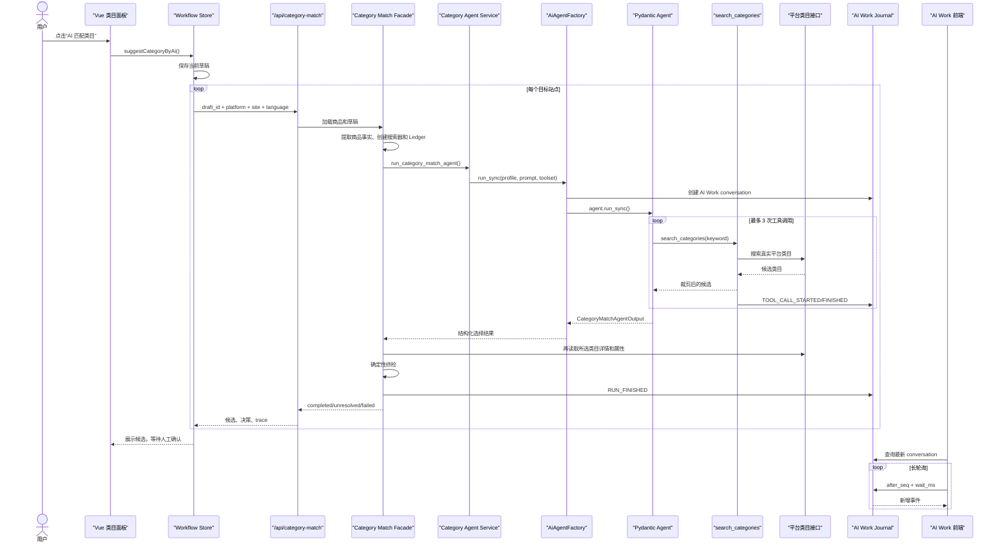

```mermaid
sequenceDiagram
    actor User as 用户
    participant Vue as "Vue 类目面板"
    participant Store as "Workflow Store"
    participant HTTP as "/api/category-match"
    participant Facade as "Category Match Facade"
    participant Service as "Category Agent Service"
    participant Factory as "AiAgentFactory"
    participant Agent as "Pydantic Agent"
    participant Tool as "search_categories"
    participant Platform as "平台类目接口"
    participant Journal as "AI Work Journal"
    participant AiWork as "AI Work 前端"

    User->>Vue: 点击“AI 匹配类目”
    Vue->>Store: suggestCategoryByAi()
    Store->>Store: 保存当前草稿
    loop 每个目标站点
        Store->>HTTP: draft_id + platform + site + language
        HTTP->>Facade: 加载商品和草稿
        Facade->>Facade: 提取商品事实、创建搜索器和 Ledger
        Facade->>Service: run_category_match_agent()
        Service->>Factory: run_sync(profile, prompt, toolset)
        Factory->>Journal: 创建 AI Work conversation
        Factory->>Agent: agent.run_sync()
        loop 最多 3 次工具调用
            Agent->>Tool: search_categories(keyword)
            Tool->>Platform: 搜索真实平台类目
            Platform-->>Tool: 候选类目
            Tool-->>Agent: 裁剪后的候选
            Tool->>Journal: TOOL_CALL_STARTED/FINISHED
        end
        Agent-->>Factory: CategoryMatchAgentOutput
        Factory-->>Facade: 结构化选择结果
        Facade->>Platform: 再读取所选类目详情和属性
        Facade->>Facade: 确定性终检
        Facade->>Journal: RUN_FINISHED
        Facade-->>HTTP: completed/unresolved/failed
        HTTP-->>Store: 候选、决策、trace
    end
    Store-->>Vue: 展示候选，等待人工确认

    AiWork->>Journal: 查询最新 conversation
    loop 长轮询
        AiWork->>Journal: after_seq + wait_ms
        Journal-->>AiWork: 新增事件
    end
```